<h3><code>aziel@github ~ $ ./contributions.sh</code></h3>

  

<h3><code>aziel@github ~ $ whoami</code></h3>
<table>
  <tr>
    <td valign="top"></td>
    <td valign="top"></td>
  </tr>
</table>

## 🚀 Minha Stack Tecnológica 

  <!-- Ícones gerados via skillicons.dev (Modinha atual e design super limpo!) -->
  <a href="https://skillicons.dev">
      
      
    
  </a>

 